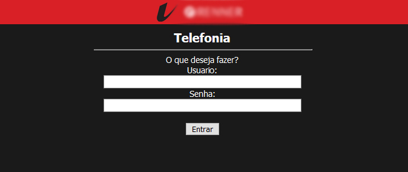
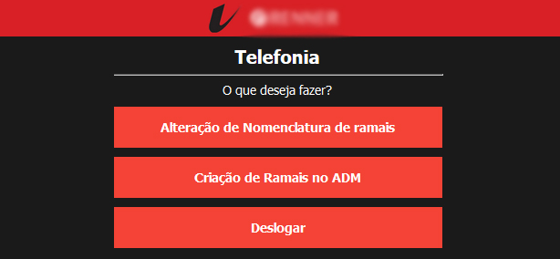
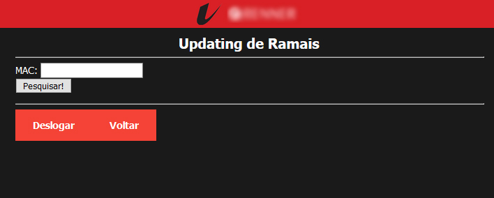
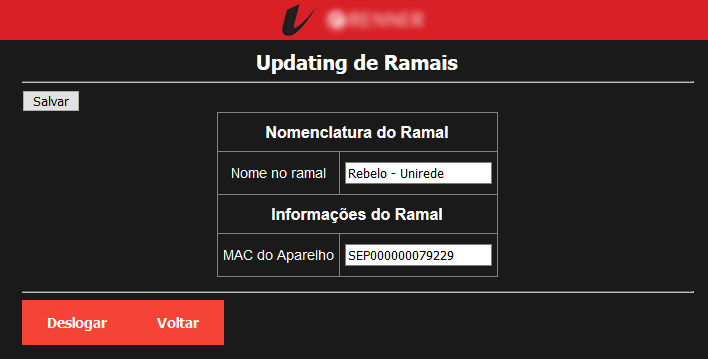
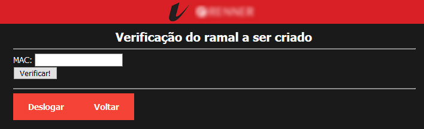
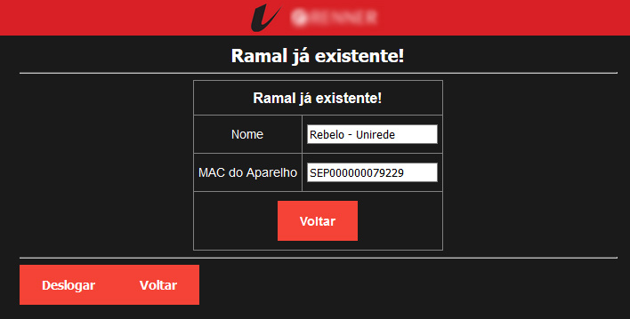
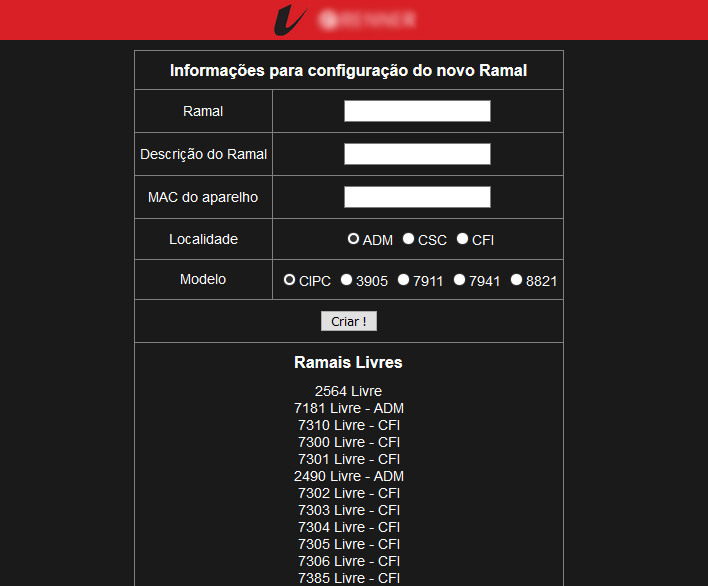
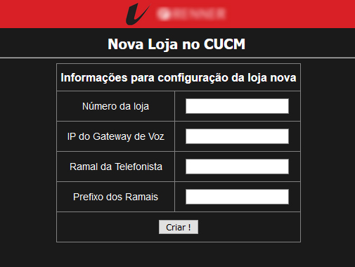

# Desenvolvimento da Solução

## Protótipos de Alta Fidelidade

### Alteraçao de Nomenclatura/Criação de Ramais
Login da Ferramenta, feito através do LDAP do Cliente

Menu pós login

### Alteração de Nomenclatura
Validação de é possível fazer a alteração é feita via MAC ADDRESS do aparelho.

Em seguida aparece os dados para alteração.

### Criação de Ramais
Para validar se é possível criar ramais também é pelo MAC ADDRESS do aparelho.

Se ramal já existir, ele informará a quem pertence.

Caso validação esteja correta, aparecerá os dados para criar o novo Ramal.

### Criação de novas lojas
Criação da infraestrutura de novas lojas/filiais, acesso sem controle.

