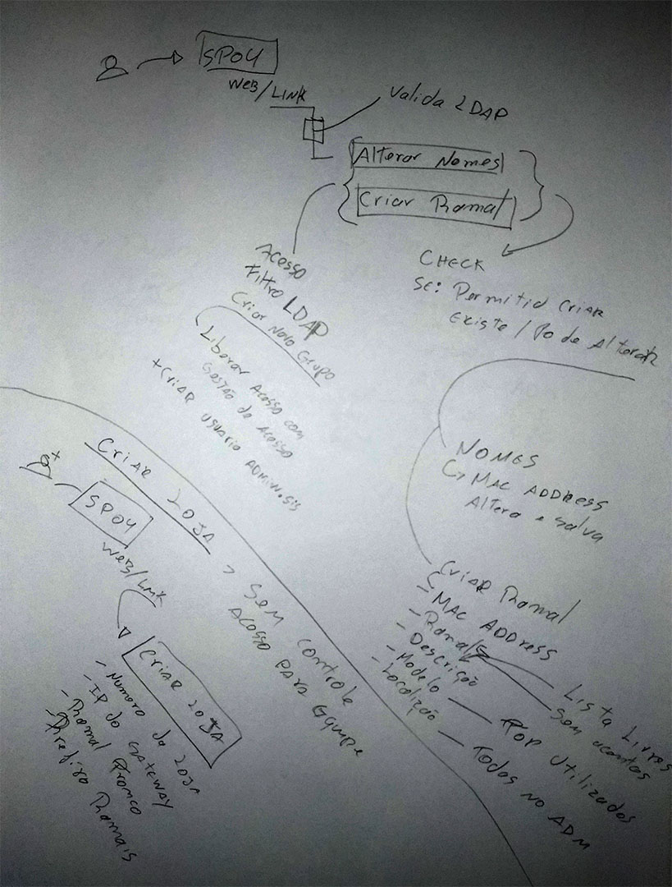
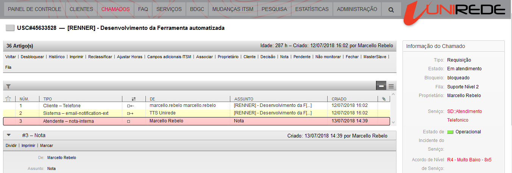
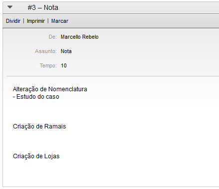
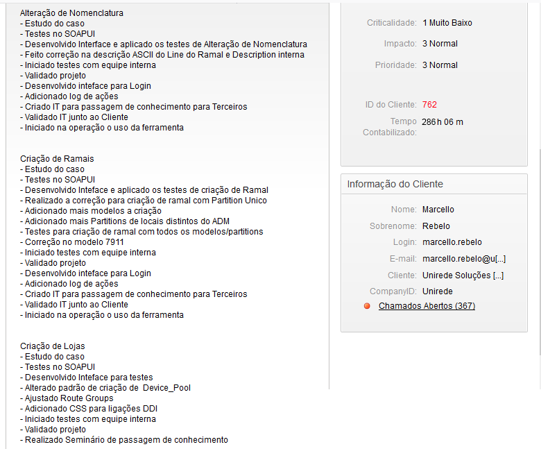

# Planejamento da Release

Prioridades foram definidas conforme o desenvolvimento da ferramenta, após o rascunho em conjunto com o stakeholder, foi dado inicio ao desenvolvimento

### Brainstorm em conjunto com Stakeholder

## Product Backlog 

O controle é feito atraves de um chamado na nossa ferramenta de tickets OTRS

### Final de todas as tarefas concluídas

#### Alteração de Nomenclatura
- Estudo do caso
- Testes no SOAPUI
- Desenvolvido Interface e aplicado os testes de Alteração de Nomenclatura
- Iniciado testes com equipe interna
- Validado projeto
- Desenvolvido inteface para Login
- Adicionado log de ações
- Feito correção na descrição ASCII do Line do Ramal e Description interna
- Criado IT para passagem de conhecimento para Terceiros
- Validado IT junto ao Cliente
- Iniciado na operação o uso da ferramenta
- Adicionado Máximo número de caracteres para descrição de ramais

#### Criação de Ramais
- Estudo do caso
- Testes no SOAPUI
- Desenvolvido Inteface e aplicado os testes de criação de Ramal
- Realizado a correção para criação de ramal com Partition Unico
- Adicionado mais modelos a criação
- Adicionado mais Partitions de locais distintos do ADM
- Testes para criação de ramal com todos os modelos/partitions
- Correção no modelo 7911
- Iniciado testes com equipe interna
- Validado projeto
- Desenvolvido inteface para Login
- Adicionado log de ações
- Criado IT para passagem de conhecimento para Terceiros
- Validado IT junto ao Cliente
- Iniciado na operação o uso da ferramenta

#### Criação de Lojas
- Estudo do caso
- Testes no SOAPUI
- Desenvolvido Inteface para testes
- Alterado padrão de criação de  Device_Pool
- Ajustado Route Groups
- Adicionado CSS para ligações DDI
- Iniciado testes com equipe interna
- Validado projeto
- Realizado Seminário de passagem de conhecimento

## Roadmap

Os Sprints foram sendo desenvolvidos conforme andamento da construção da ferramenta, atendendo as necessidade prioritárias em conjunto com o Stakeholder.

### Primeira nota do primeiro Sprint

### Última nota do último Sprint

