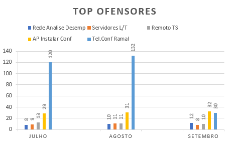
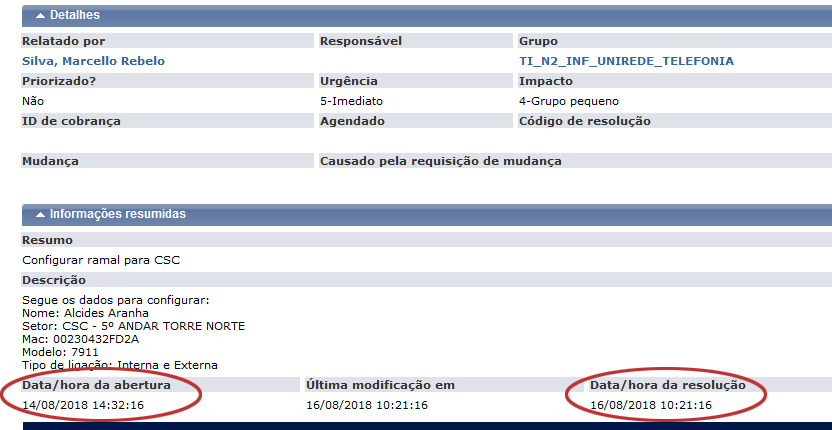
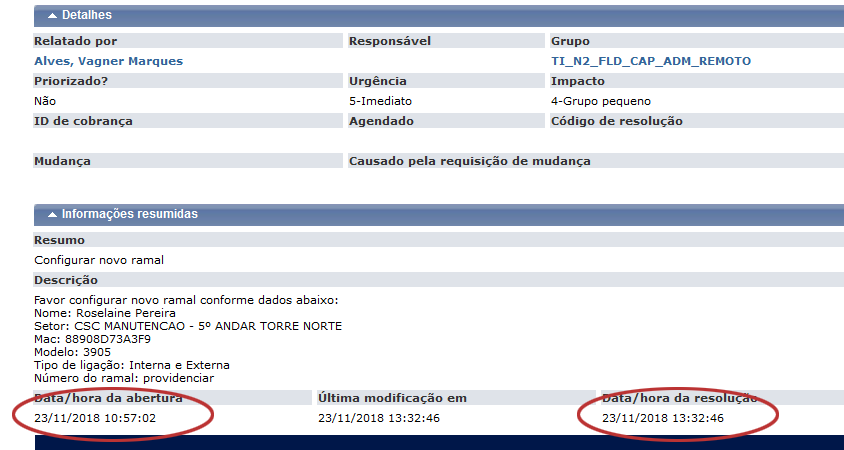

# Testes e Validação

Testes foram feitos em conjunto com o stakeholder, assim que uma das etapas era concluída, era realizado os testes e se necessário ajustes, tal qual a validação da ferramenta.

Assim que finalizado o projeto, o stakeholder fez a ultima validação e inserimos usuários internos de testes que foram liberados somente para equipe local.

No parecer da equipe local, ferramenta atendeu conforme esperado, porém foi reportado um bug o qual quando eram criado os ramais as descrições dos mesmos não eram alteradas, bug que foi corrigido no ato.

## Validação junto ao Cliente
No Book de Negócios foi possível ver o ganho que a ferramenta trouxe para empresa, quantidade de tickets da categoria em questão reduziu em 75% no primeiro mês de uso.

## Tickets atendidos antes e depois da utilização da ferramenta

Esta imagem mostra o ticket sendo atendido antes do desenvolvimento da ferramenta

Como o ticket passa por diversas equipes até chegar a equipe resolvedora, o  tempo é demasiado.

Esta imagem mostra o ticket sendo atendido após do desenvolvimento da ferramenta

O ticket agora é tratado em uma equipe assim que é aberto, não requerendo ações de outras equipes, assim o tempo de atendimento é reduzido.

